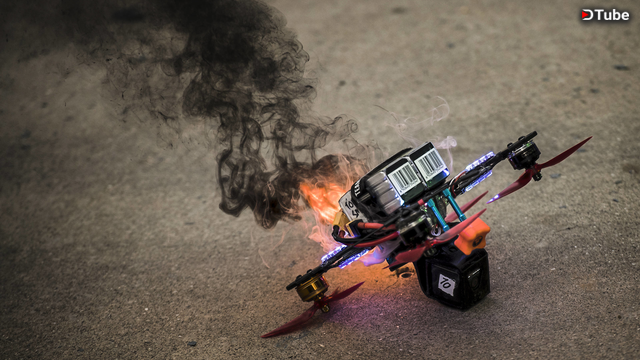
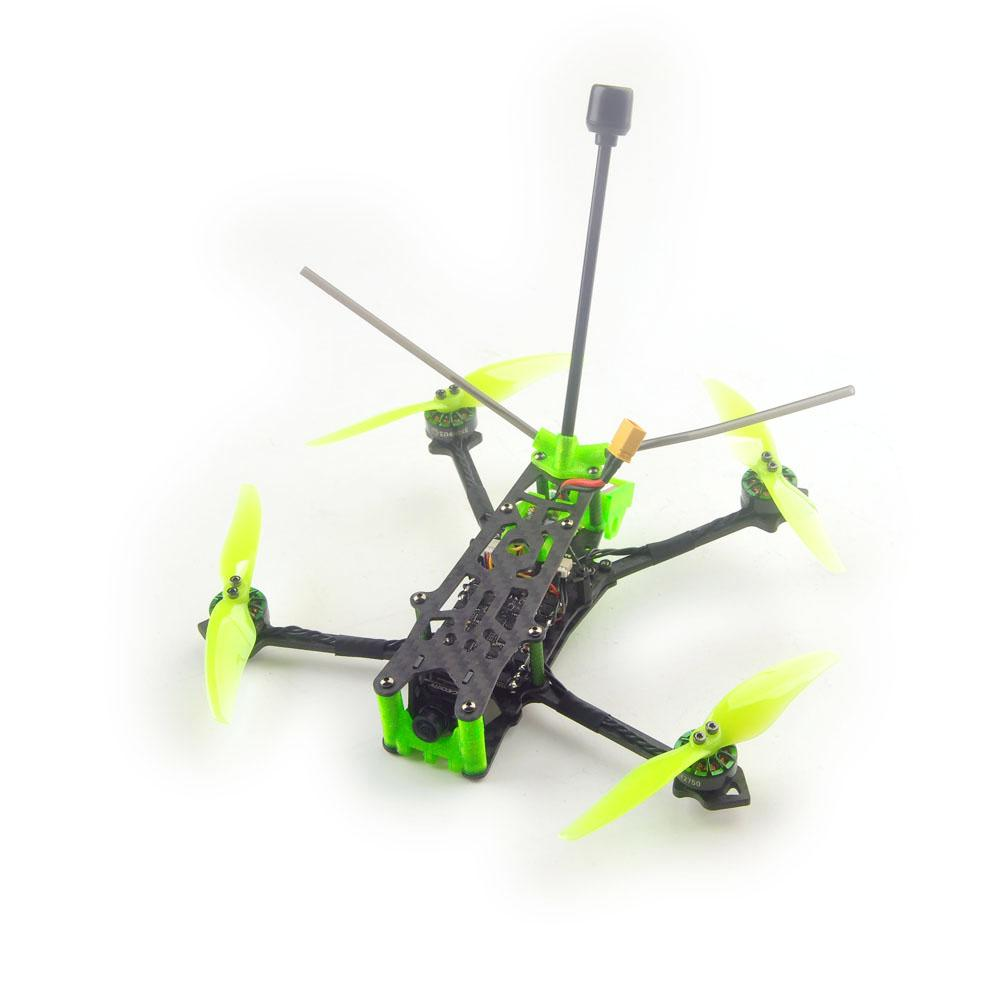
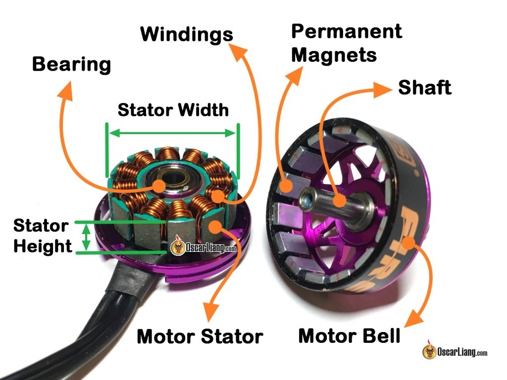

Wie baue ich meinen eigenen Quadcopter?

---

## PHOTO vs. FPV

|              |   |
| ------------------ | ------------------- |
  |  

---

Lexie Janson

---

## Freestyle

## Racing

## Longrange

--

<!-- .slide: class="two-floating-elements" -->
## Freestyle

- robust
- etwas mehr Gewicht
- viel Power
- Platz für Action Cam
- Platz für Erweiterungen   

--

https://www.youtube.com/watch?v=I_PoQCq4O9k

--

<!-- .slide: class="two-floating-elements" -->
## Racing

- kompakter
- hohe Geschwindigkeit
- viel Power
- leichter als Freestyle
- sehr niedrige Latenz

--

https://www.youtube.com/watch?v=OXVdYDcknFA

--

<!-- .slide: class="two-floating-elements" -->
## Longrange

- nicht so stabil
- leichter
- weniger Power
- länger Flugdauer
- optimale Antennenanordung
- hohe Flugdistanz

---

## Ort zum Fliegen - Größe

- Haus (65mm) -> kaufen
- Garten (75mm) -> kaufen
- Park (3")
- Freies Feld (5")

---

--

<!-- .slide: class="two-floating-elements" -->
## Frame

- Größe - Propeller-Druchmesser
- 5" oder 3"
- Kohlenstofffaser (Carbon)
- Komponenten innen schützen
- Hält alles zusammen

--

<!-- .slide: class="two-floating-elements" -->
## Flugsteuerung und ESC

- Stack vs. AIO
- FC
    - µC (STM32F4, STM32F7)
    - 3-Achsen-Gyroskop
    - On-Screen-Chip
    - Flash (Blackbox), UARTs
- ESC (Single/4in1)
    - Silabs EFM8 (8051 Core)
    - Bis 65 A 
    - Shunt

    

--

<!-- .slide: class="two-floating-elements" -->
## Motor

- Brushless
- Drehstrom Synchronmaschine
- 40.000 bis 60.000 U/min
- 0,5 kW / Motor
- KV - Rotations/Volt
- 5" ->  2306 oder 2207
- 3" ->  1103, 1202, 1204, 1303

    

--

## Propeller

- Viele kaufen am Anfang
- 2 Blade, 3 Blade
- Steigung: groß -> mehr power, weniger kontrolle

    

--

<!-- .slide: class="two-floating-elements" -->
## RC-Link

- ExpressLRS
- 2.4 GHz LoRa
- Latenz bis < 5 ms
- Reichweiten bis 30 km
- Open Source :)
- ESP8285

--

## Video link

Analog vs. Digital

--

<!-- .slide: class="two-floating-elements" -->
## FPV Camera

- Überwachungskameras
- CCD, CMOS
- 16:8, 4:3 -> Passend zur Brille
- 5" -> micro 19mm
- 3" -> nano 14 mm
- FOV: Breiter -> Fisheye
- Analog

--

## Video transmitter

- 5.8 Ghz
- alte Rundfunktechnik
- Leistung 25mW bis etwas über 1 Watt
- Analog

--

<!-- .slide: class="two-floating-elements" -->
## Antenne

- Omnidirektional

--

<!-- .slide: class="two-floating-elements" -->
## Batterie

- Li-Polymer
- Achtung! Gefährlich
- Richtiges Ladegerät, Lagerung
- 5" -> 6S, 90C
- 3" -> 4S

--

<!-- .slide: class="two-floating-elements" -->
## Buzzer

- Piepst laut
- Eigener Akku

--

<!-- .slide: class="two-floating-elements" -->
## Action Cam

- teuer
- GoPro
- Erst wenn man es gut kann

---

---

---

## Kosten

- Frame: **25 EUR**
- Flugelektronik (Stack, ESC): **100 EUR**
- Motoren: **4x 17 EUR**
- Propeller Set: **4x 3 EUR**
- Receiver: **20 EUR**
- Kamera: **30 EUR**
- Videotransmitter: **40 EUR**
- Antenne: **15 EUR**
- Batterie: **2x 30 EUR**
- Buzzer: **5 EUR**

---

## 378 EUR 😱

---

## Was noch?

- Fernsteuerung
    - FrSky Taranis: **130 EUR**
    - Radiomaster TX16S: **280 EUR**
- Brille
    - EACHINE EV800D: **60 EUR**
    - SKYZONE SKY04X: **600 EUR**
    - FatShark Dominator HDO 2: **700 EUR**
- Ladegerät
    - ISDT 608AC: **80 EUR**

---

## Gesetzlich

- 250g Grenze
- Abstand!
    - Personen!
    - Bundesstraßen, Autobahnen, Stromtrassen
    - Krankenhäuser, Flughäfen (2km)
    - öffentl. Einrichtungen, Behörden
    - private Grundstücke
- "Drohnen-Haftpflichtversicherung"
- Spotter einsetzen
- Führerschein -> [LBA](https://www.lba.de/DE/Drohnen/Fernpiloten/Anforderungen_Fernpiloten_node.html)
- App: Map2Fly

---

## Einstieg mit Simulator

- LiftOff
- Uncrashed
- AI Drone Simulator

---

## Wo kaufen?

- https://www.rotorama.de/
- https://www.copterfarm.de/
- https://www.rctech.de/
- Ali Express

---

## Quellen

- https://www.youtube.com/c/joshuabardwell
- https://oscarliang.com/how-to-build-fpv-drone/
- https://www.getfpv.com/learn/new-to-fpv/multirotor-drone-decision-flowchart/
- https://quadquestions.com/blog/2017/02/22/choose-right-size-motors-drone/
- https://www.youtube.com/watch?v=8hHNm-dFicc
- https://www.fpvknowitall.com/fpv-shopping-list-five-inch-freestyle/
- https://www.fpvknowitall.com/ultimate-fpv-shopping-list/
